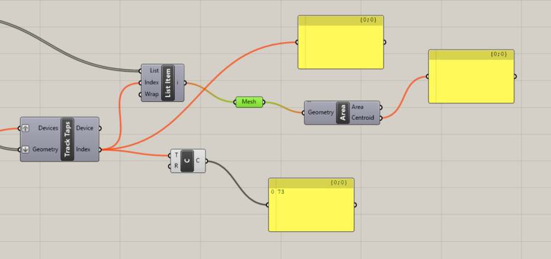

In fologram plugin in grasshopper Sync object can be set as grabbable or not. I think one big challenge would be to constrain how an user can grab and manipulate these objects. There is an article about [manipulating objects with snaps](https://community.fologram.com/t/manipulating-objects-with-snaps/1040)

# Exploring grashoppe capabilities

I can use the Track taps to identify which object has been moved and it's index to propagate the changes to the other spheres. When dragging track taps updates twice, once for the start and once for the end.
I used [this example](https://community.fologram.com/t/how-to-keep-track-of-devices-interacting-with-objects-in-augmented-reality/193) to show how to detect the taps

# First version of toolpath editor:

- The [toolpath generation is based on the basic cylinder primitive of coilcam](https://ecl.mat.ucsb.edu/coilCAM)

- The ray casting is a bit problematic for the small objects of the toolpath this example [shows an implementation of ray casting but I am not sure how it would work with the hololens](https://community.fologram.com/t/how-to-get-the-whole-design-team-engaged-with-a-parametric-facade-model/109)

# Direct manipulation flow in grashopper triggers recursive loop
- How to change the other sphere positions once I change the position of one of them?
	- If I try to send the new sphere position to the original script that generates the grid I get an error of recursive data stream
		- 
		- I am trying to use a global variable but it appears it needs to be sync manually
		- When I try a global variable with a dynamic update I also get a 1. Recursive loop detected, please turn off dynamic updating.
		- 
		- When looking in the blog about recursions I found some info about recursions in [this blog](https://community.fologram.com/t/kangaroo-grab-through-fologram/369) maybe continue taking a look
		- I added a q in the community forum [here](https://community.fologram.com/t/direct-manipulation-flow-in-grashopper-triggers-recursive-loop/1079)
# Using the Track State component

A [fologram staff suggested ](https://community.fologram.com/t/direct-manipulation-flow-in-grashopper-triggers-recursive-loop/1079)using the track state component and a gate to avoid the recursive loop alert, they also suggested I could use a button instead. 

I created a script that checks if any of the strings in the state array is ‘Release’ and connected it to the gate. Then I used the taps component to check which element was selected. I use this to move all the objects near that object.

There are a few issues with this…The Track State component will trigger with any user interaction, so I am unsure if it’s actually dragging something. I am also getting some repeating motions that I am unsure are due to the state triggering multiple times.

You can see the update in the position that gets triggered multiple times in [this video](https://photos.app.goo.gl/w5Y3tD8GLVS3kGVt8)

Is there a way to better detect the click on a single object or know that an object was clicked without the recursive loop?